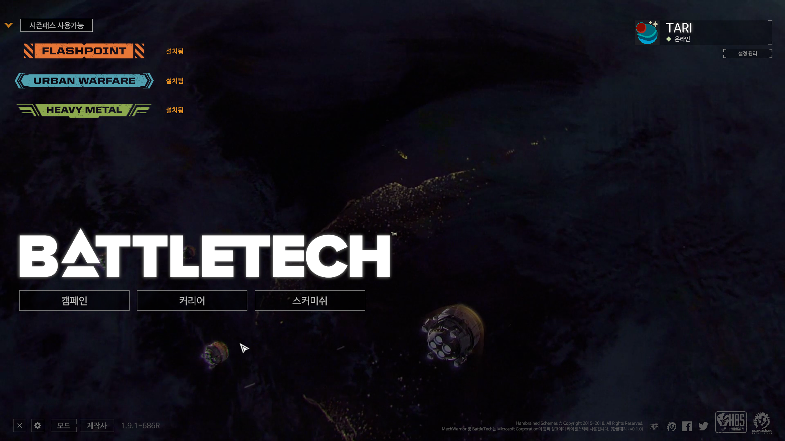
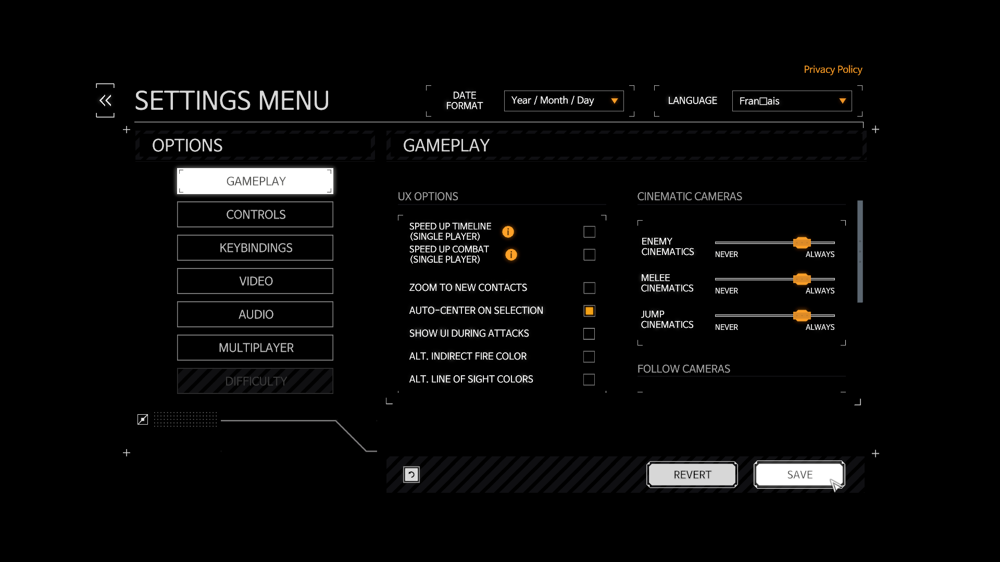
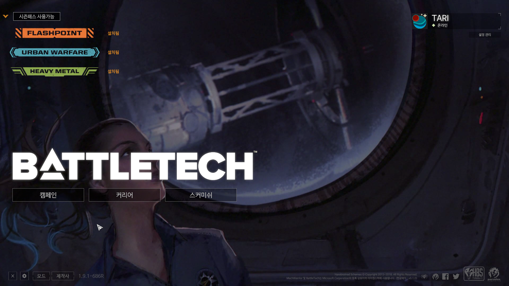
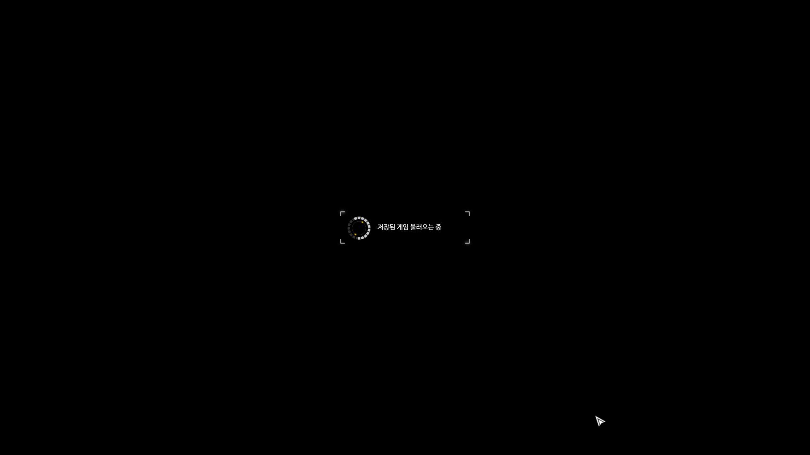
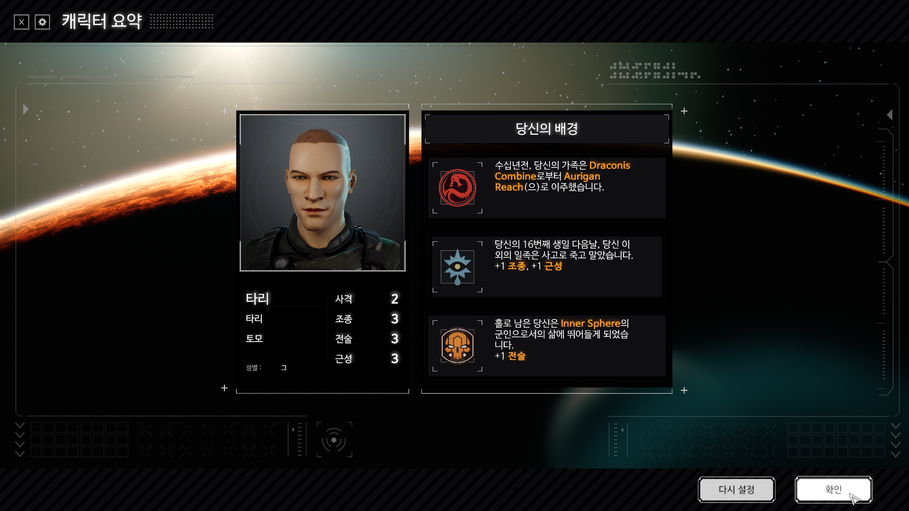
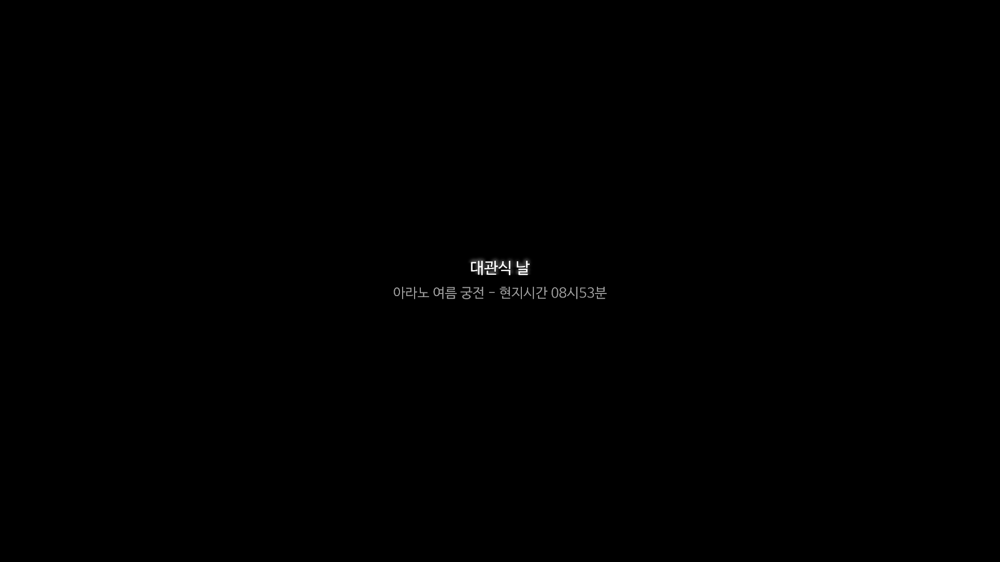
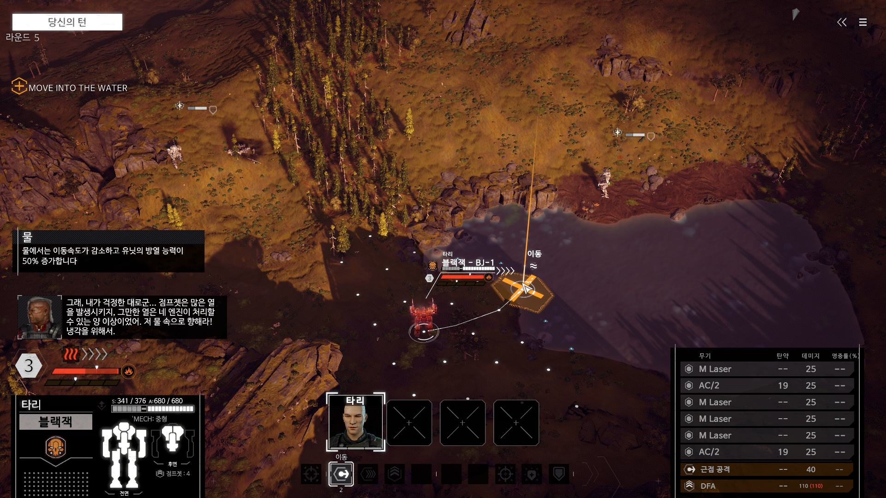
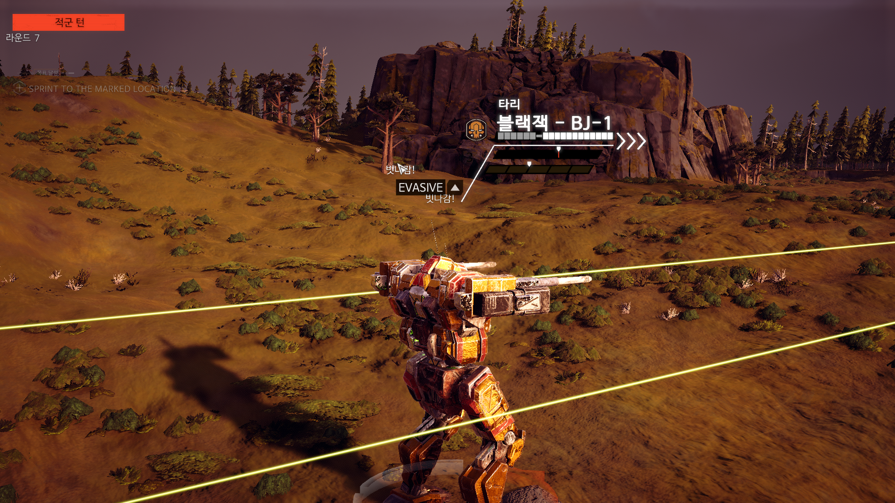

# 배틀테크 Steam PC 유저 한글 패치 V0.1.0 (2020.07.21)

[배틀테크 (Steam, PC)](https://store.steampowered.com/app/637090/BATTLETECH/)의 유저 한글 패치입니다. 

## 1. 다운로드 및 적용방법

1. 아래 링크로 이동하여 모드파일(`FontReplaceMod_KOR.zip`) 및 번역파일(`BattleTech-kor_Test_<버전>.zip`) 을 다운로드 합니다.
2. 배틀테크 모드 폴더에 「`FontReplaceMod_KOR.zip`」파일의 압축을 해제합니다. (일반적으로 `C:\Users\(계정명)\Documents\My Games\BattleTech\mods`)
2. 배틀테크가 설치된 디렉터리로 이동합니다. (일반적으로 `C:\Program Files (x86)\Steam\steamapps\common\BATTLETECH`)
3. 현재 디렉터리에 `BattleTech-kor_Test_<버전>.zip` 파일의 압축 내용을 풀어 덮어 씌웁니다.

[배틀테크 비공식 한글패치 다운로드](https://drive.google.com/drive/folders/1AAj6vKO8D8C2-hfrxVvLAusnGER5t_ij?usp=sharing)

### 적용방법

## 2. 번역/검수 및 피드백은 어디에서 할 수 있나요?
・디시인사이드 배틀테크-맥워리어 마이너 갤러리를 참고하셔서 번역/검수에 참여하거나 피드백을 남겨주세요! 
・우리가 만들어가는 유저 한글 패치인만큼 여러분들의 도움이 절실합니다! 

## 테스트 스크린샷

## License

본 프로젝트는 [MIT License](./LICENSE) 하에 제공됩니다.
